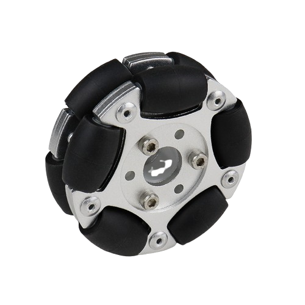

<div align="center"></div>
<h1 align="center">4-Omniwheels Base</h1>

<div align="center">


 <br>


</div>

## Table of Contents
- [Table of Contents](#table-of-contents)
- [🙏 Credits](#-credits)
- [📖 About](#-about)
- [📦 Structure](#-structure)
- [🔧 Build](#-build)
- [📜 License](#-license)

## 🙏 Credits

- Thanks to [dragonfuneste](https://github.com/dragonfuneste) for his contribution, naming
  - Helped me with the code
  - Provided examples and inspiration with his [own
    project](https://github.com/dragonfuneste/Projet_Asmodeus)
  - Tought me many things on robotics


## 📖 About

This projects was the code of our wheeled base during the [French Cup of
Robotics](https://www.coupederobotique.fr) in 2025.

> [!NOTE]
>
> This project was setup with
> [STM32CubeIDE](https://www.st.com/en/development-tools/stm32cubeide.html) with the
> [STM32F411CEU6](https://www.st.com/en/microcontrollers-microprocessors/stm32f411ce.html) as the
> specified target MCU

## 📦 Structure

**Directories**

  - [**`Src`**](./Core/Src/) - Source files (`.c`)
  - [**`Inc`**](./Core/Inc/) - Headers (`.h`)

**Files**

- `pid.c` – Implements a robust numerical PID controller.
- `encoders.c` – Interfaces with rotary incremental encoders.
- `moteurs.c` – Provides a basic motor control interface.
- `log.c` – Custom logging module for tracking system activity.
- `imu.c` – Driver for the
  [MPU-9250](https://invensense.tdk.com/products/motion-tracking/9-axis/mpu-9250/) IMU.
- `uart.c` – UART communication module for logging and control.
- `altimu.c` – Interface for the [AltIMU-v4](https://www.pololu.com/product/2470) sensor.
- `fusion.c` – Handles 9-DoF sensor fusion.
- `odometrie.c` – Implements odometry for a 4-omniwheel robot.
- `asserv.c` – Feedback control for motors and robot movement.

## 🔧 Build

> [!WARNING]
>
> STM32CubeIDE builds the project only for the specified target (MCU)

To build this project, first install the
[STM32CubeIDE](https://www.st.com/en/development-tools/stm32cubeide.html) on your system.

Then, you can clone this repo

```bash
git clone https://github.com/leoraclet/wheeled-base
```

And open / import the project into STM32CubeIDE

---

If you want to build for another target, then create a new project for the wanted target and just
copy the source files of this project, with the corresponding headers, into your project.

## 📜 License

This project is licensed under the MIT License - see the [LICENSE](LICENSE) file for details.